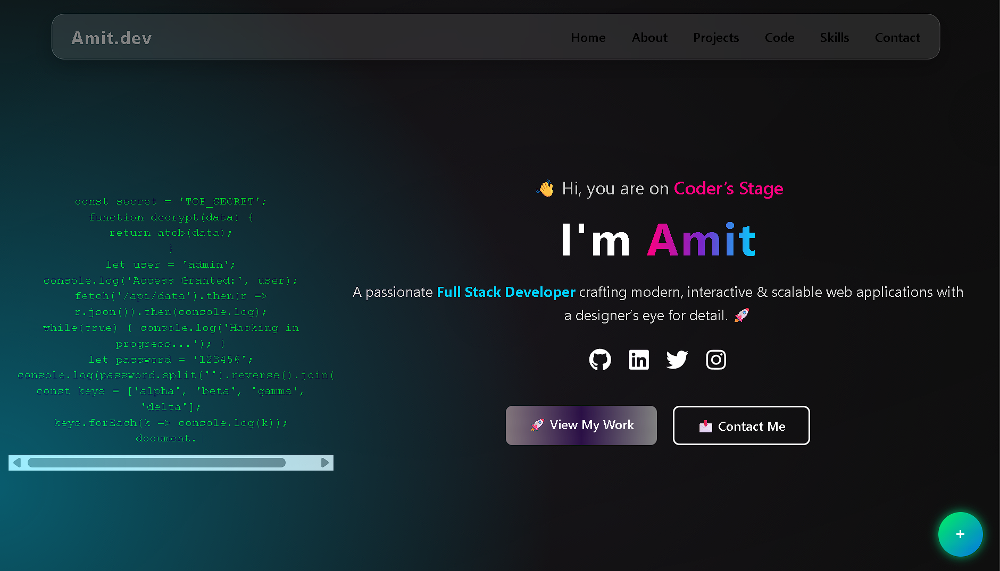
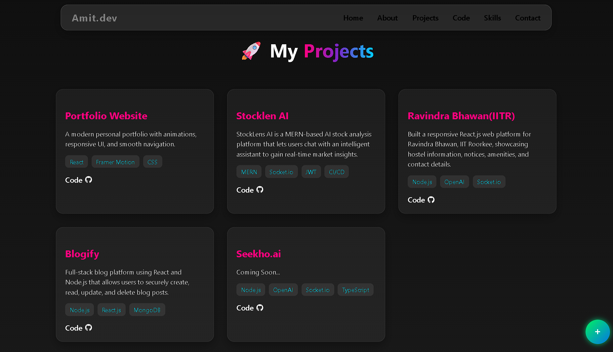
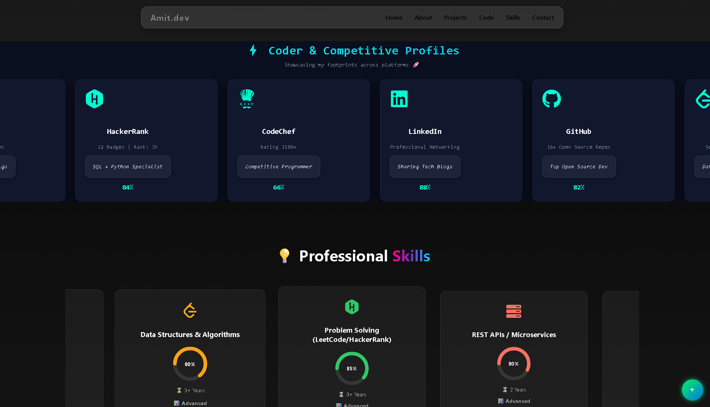

  
  

  
  

# 🚀 Amit Kumar | Developer Portfolio

🔗 **Live Portfolio:**  
https://main-portfolio-liart-five.vercel.app/

---

## 📌 About Me

I’m **Amit Kumar**, a **B.Tech graduate from IIT Roorkee** and a passionate **Full Stack Developer** specializing in the **MERN stack**.  
I enjoy building **scalable, responsive, and user-focused web applications** that solve real-world problems with clean design and efficient code.

I have a strong foundation in **C++ and Data Structures**, and I continuously work on improving my development and problem-solving skills.

---

## ✨ Features of the Portfolio

- Smooth auto-scroll landing experience
- Fully responsive design
- Projects showcase with descriptions
- Skills and coding profiles section
- Contact form integration
- Clean and modern UI

---

🚀 Deployment

This portfolio is deployed using Vercel.

To run locally:

git clone https://github.com/amitkumar0072/Main-Portfolio.git
cd Main-Portfolio
npm install
npm start

To create a production build:

npm run build

📬 Contact

Portfolio: https://main-portfolio-liart-five.vercel.app/

GitHub: https://github.com/amitkumar0072

LinkedIn: (www.linkedin.com/in/amit-kumar-92111b241)
